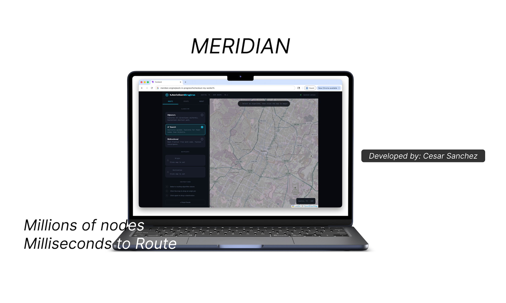

# Meridian: True pathfinding, powered by C++ microservices.

 
*Drop a pin, calculate the math, find the route.*

## What is Meridian?
Meridian is a custom, full-stack routing engine built from scratch. It parses real-world OpenStreetMap (OSM) data for the city of Austin, Texas, holding 1.4 million nodes in memory to calculate the true shortest physical path between any two intersections. 

Instead of relying on third-party routing APIs, Meridian does the math on bare metal using a custom implementation of Dijkstra's Algorithm, exposed to the web via a C++ microservice.

## Under the Hood
This project was built to bridge the gap between low-level systems engineering and modern web architecture.
* **The Engine (Backend):** C++17, utilizing `libosmium` to parse raw map data and `Crow` to handle multithreaded REST API requests.
* **The Visualizer (Frontend):** React (Vite) and `Leaflet.js` for interactive, dynamic map rendering.
* **The Math:** Haversine formula for spatial distance, and an optimized graph adjacency list for $O(V + E \log V)$ pathfinding.

## How to Run It Locally
You will need two terminal windows to run the microservice architecture.

### 1. Boot the C++ Backend
The server needs to parse the map data and open Port 8080.
```bash
cd backend
cmake -B build
cmake --build build && ./build/server
```

### 2. Start the Frontend Server
Once the backend says `API LIVE`, run the following:
```bash
cd frontend
npm install
npm run dev
```

Once you open the given link on the terminal. Click anywhere in Austin to drop a Start pin, then click again to drop an End pin, and watch as it draws the path.

## Video Demo


https://github.com/user-attachments/assets/821fe188-156f-4701-b86c-b7a0fbc3cae0

